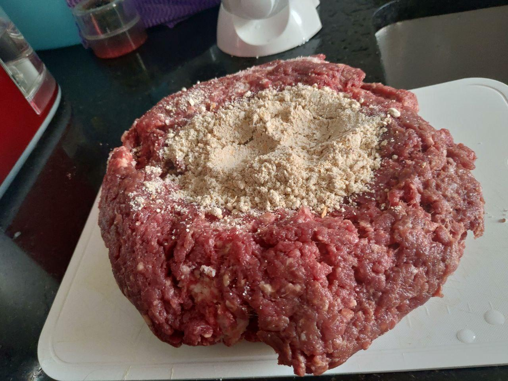
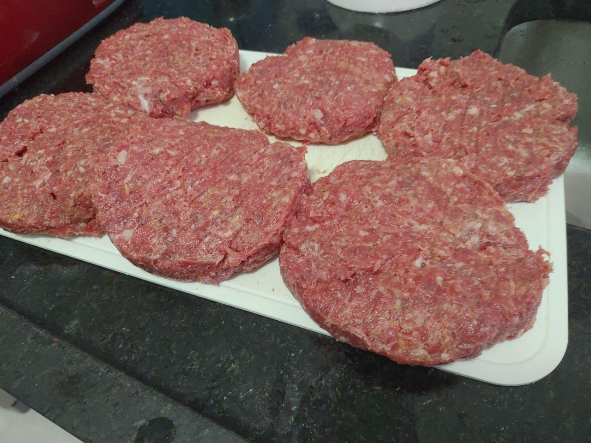

# Burger recipe

## What we gonna need

1. Ingredients:  
    ```text
    1kg of Duck beef  
    300g of Bacon  
    1 package of instant onion soup  
    Tip: Ask for your butcher to grind the bacon and the duck beef together.
    Kitchen Oil
    ```

2. Other items:
    ```text
    Aluminum foil
    Baking Tray
    ```

## How to do

1. Mix everything together until the onion soup got mixed.  
    

2. Creat little ball, like meat-ball, and press it to create the disk. The amount of meat will vary by your taste and the size of burger you want.  
   

3. Take a aluminum foil and pour a little amount of kitchen oil.  

4. Put your burger inside the aluminum and wrap it up.  

5. Warm yout oven for 10 minutes in 230 degrees Celsius  

6. Put the burger wrap in the oven for 20 minutes in 205 degrees Celsius.  

7. Turn it around and let it in the oven for another 20 minutes.  

8. take it out of the oven and check meat spot.  